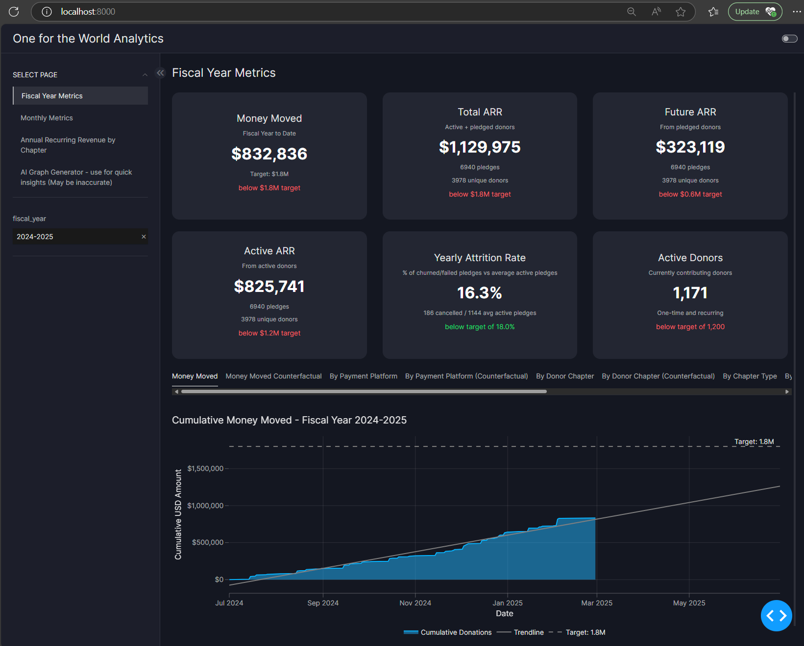

# OFTW Data Analytics Dashboard

This project provides an interactive dashboard for analyzing One For The World (OFTW) pledge and payment data from 2014 to present. The dashboard offers various insights and visualizations to help understand donation patterns, pledge fulfillment, and other key metrics.

App building challenge thread: <https://community.plotly.com/t/plotly-oftw-app-building-challenge/90724/43>



## Features

- Interactive data visualizations using Plotly and Vizro
- AI-powered insights generation (optional)
- Historical pledge and payment analysis
- Customizable date ranges and filtering options

## Setup

1. Clone the repository:
```bash
git clone <your-repository-url>
cd oftw_app_building_challenge
```

2. Create and activate a virtual environment (recommended):
```bash
python -m venv venv
source venv/bin/activate  # On Windows, use: venv\Scripts\activate
```

3. Install dependencies:
```bash
pip install -r requirements.txt
```

4. Environment Setup (Optional - for AI Features):
   - Create a `.env` file in the `src` directory
   - Add your Google API key for AI functionality:
   ```
   GOOGLE_API_KEY=your_api_key_here
   ```

## Running the Application

1. Navigate to the src directory:
```bash
cd src
```

2. Run the application:
```bash
python app.py
```

3. Open your web browser and navigate to `http://localhost:10000` (or the URL shown in your terminal)

## Data Sources

The application uses two main data sources:
- Pledge data: Historical pledge information from OFTW supporters
- Payment data: Actual payment records linked to pledges

If you want to refresh the data sources with updated data, make sure to remove the *.pkl files so they can be regenerated.

## Contributing

Feel free to submit issues and enhancement requests!

## License

Apache 2.0 (Same as Vizro)
